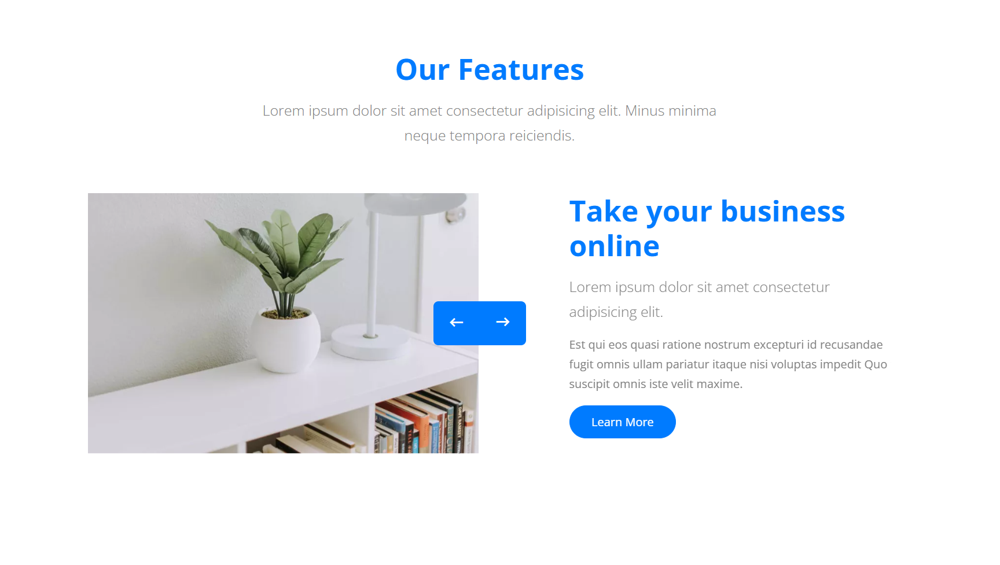

# Sass

1.  sukurti "\_btn.scc"
2.  ji itrraukti i main.scss
3.  jame aprasyti mygkuta pagal pavyzdi
4.  pvz https://preview.colorlib.com/theme/nitro/

## praktika

1. darom desktop su scss our features
2. 
